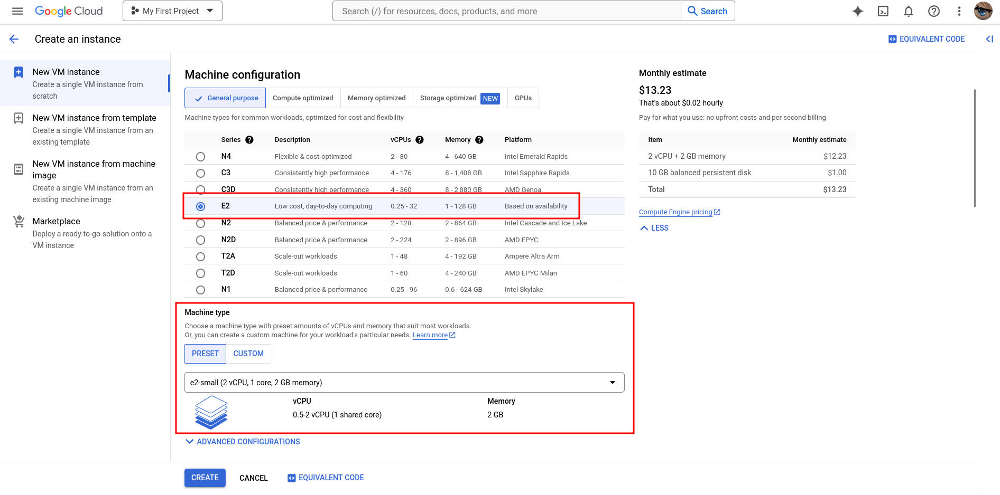
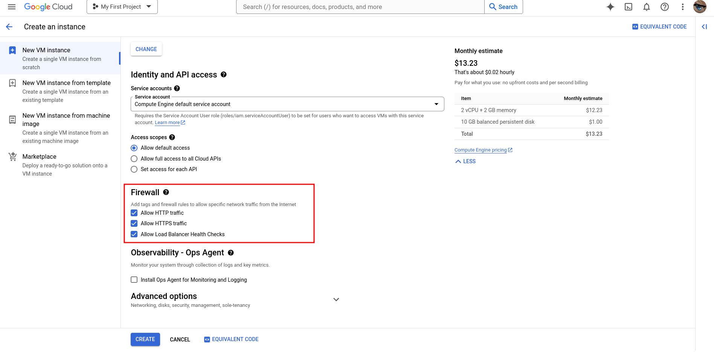

# ST0256 Tópicos Especiales en Telemática

## Estudiante(s):
- David Fonseca Lara (dfonsecal@eafit.edu.co)
- Julian Andres Romero Hinestroza (jaromeroh@eafit.edu.co)
- Juan Esteban Avendaño Castaño (jeavendanc@eafit.edu.co)

## Profesor: 
- *Nombre:* Álvaro Ospina
- *Correo:* aeospinas@eafit.edu.co

# Proyecto 2 - Cluster Kubernetes

## 1. Breve descripción de la actividad
### 1.1. Que aspectos cumplió o desarrolló de la actividad propuesta por el profesor (requerimientos funcionales y no funcionales)

Desplegamos la aplicación CMS/LMS dockerizada (WordPress) en un clúster Kubernetes configurado con MicroK8s.
El clúster se encuentra distribuido en al menos tres máquinas virtuales en AWS, asegurando alta disponibilidad.

Implementamos un balanceador de cargas.
La aplicación se desplegó utilizando réplicas para garantizar la alta disponibilidad y la tolerancia a fallos.

Desplegamos una base de datos MySQL con volúmenes persistentes gestionados por un servidor NFS.
Configuramos PersistentVolumes (PV) y PersistentVolumeClaims (PVC) para gestionar el almacenamiento de manera eficiente y segura.

Registramos un dominio personalizado y configuramos los registros DNS para que apunten al balanceador de cargas.

### 1.2. Que aspectos NO cumplió o desarrolló de la actividad propuesta por el profesor (requerimientos funcionales y no funcionales)
Cumplimos con todo 🎉

## 2. información general de diseño de alto nivel, arquitectura, patrones, mejores prácticas utilizadas.


## 3. Ambiente de desarrollo y ejecución (Configuración del Cluster y despliegue de la aplicación)
### Creación de las instancias
Para las instancias usadas para los nodos del cluster se utilizó el servicio de GCP, y se crearon 3 instancias con las siguientes características:

> Se usa una instancia `E2 small` para que soporten microk8s
> 

> Activar las reglas de firewall
> 

### Instalación de MicroK8s
Para la instalación de MicroK8s se siguió la guía oficial de la página de MicroK8s, la cual se encuentra en el siguiente [link](https://microk8s.io/docs/getting-started).

Hay que hacer lo siguiente:

##### PRIMERO: 
instalar snap:  
```bash
sudo apt install snap -y && sudo apt install snapd -y
```

##### SEGUNDO: 
instalar microk8s: 
```bash
sudo snap install microk8s --classic
```

### Creación del cluster
Para la creación del cluster debemos dirijirnos al nodo maestro y ejecutar el siguiente comando:

```bash
microk8s add-node
From the node you wish to join to this cluster, run the following:
microk8s join 10.128.0.7:25000/4ba95021d5567941c329d2500bc8f023/105d18a7bb28

Use the '--worker' flag to join a node as a worker not running the control plane, eg:
microk8s join 10.128.0.7:25000/4ba95021d5567941c329d2500bc8f023/105d18a7bb28 --worker

If the node you are adding is not reachable through the default interface you can use one of the following:
microk8s join 10.128.0.7:25000/4ba95021d5567941c329d2500bc8f023/105d18a7bb28
```

Con este comando obtenemos el comando que debemos ejecutar en los nodos workers para unirlos al cluster, en nuestro caso ejecutamos el siguiente comando en los nodos workers:

```bash
$ microk8s⋅join⋅10.128.0.7:25000/4ba95021d5567941c329d2500bc8f023/105d18a7bb28
```
> [!IMPORTANT]
> El comando `microk8s add-node` se ejecuta cada vez que se quiera agregar un nuevo nodo al cluster.


### Configuración del NFS 

##### Paso 1: Instalación del servidor NFS Kernel
Para configurar el servidor NFS, primero se necesita instalar el paquete NFS-Kernel-Server. Es necesario ejecutar el siguiente comando:

```bash
sudo apt update
sudo apt install nfs-kernel-server
```

##### Paso 2: Crear el directorio de exportación
Crear el directorio que se desea compartir con los clientes (en nuestro caso, el cluster). Nosotros usamos el directorio /var/nfs/general (puede ser cualquiera). 

```bash
sudo mkdir -p /var/nfs/general
sudo chown nobody:nogroup /var/nfs/general
```

##### Paso 3: Configuración de las exportaciones NFS
Una vez que el directorio este listo, se debe editar el archivo /etc/exports para ponerlo a disposición del cluster. 

```bash
sudo nano /etc/exports
```

Añadir la siguiente línea al archivo, la cual especifica el directorio a compartir, el cliente y las opciones de compartición:

```bash
/var/nfs/general    client_ip(rw,sync,no_subtree_check)
```

Reemplazar client_ip con la dirección IP de la máquina cliente. Para múltiples clientes, añadir cada cliente en una linea.

#### Paso 4: Exportación del directorio compartido
Después de configurar las exportaciones, aplica los cambios ejecutando el comando exportfs:

```bash
sudo exportfs -a
```

#### Paso 5: Iniciar y habilitar el servidor NFS

Iniciar el servidor NFS y preferiblemente que se inicie automáticamente al arrancar el sistema:

```bash
sudo systemctl start nfs-kernel-server
sudo systemctl enable nfs-kernel-server
```

## referencias:
- [Instalación y configuración de MicroK8s](https://microk8s.io/docs/getting-started)
- [Configuración cluster de kubernetes](https://microk8s.io/docs/clustering)
- [Configuración del NFS](https://reintech.io/blog/setting-up-nfs-server-ubuntu-20-04)
- [Configuración de WordPres en Kubernetes](https://sesamedisk.com/deploy-wordpress-on-k8s/)
- [Configuración de certificados SSL](https://stackoverflow.com/questions/67430592/how-to-setup-letsencrypt-with-kubernetes-microk8s-using-default-ingress)
- [Cofigurar un Ingress en Kubernetes](https://kubernetes.io/docs/concepts/services-networking/ingress/)
